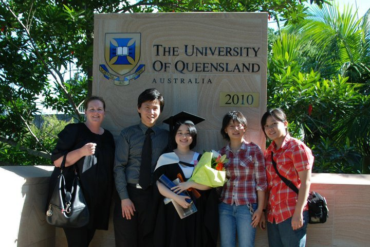
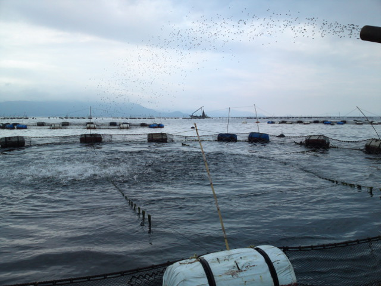
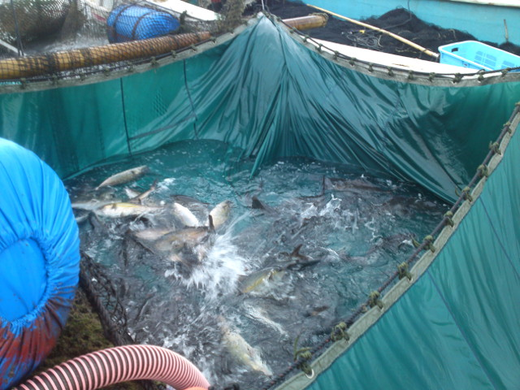
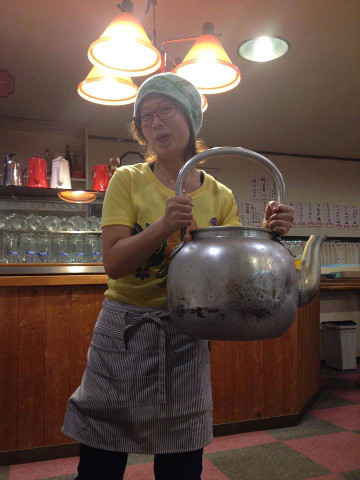
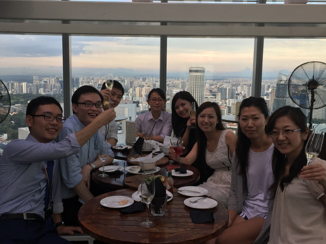
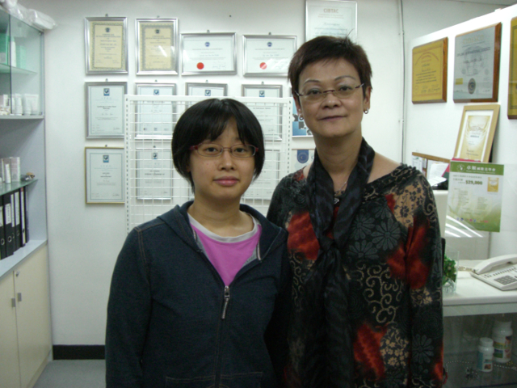
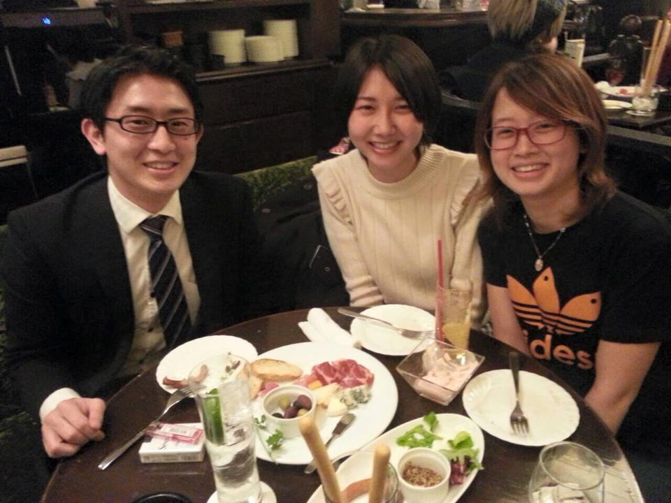
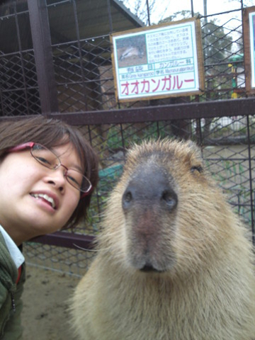
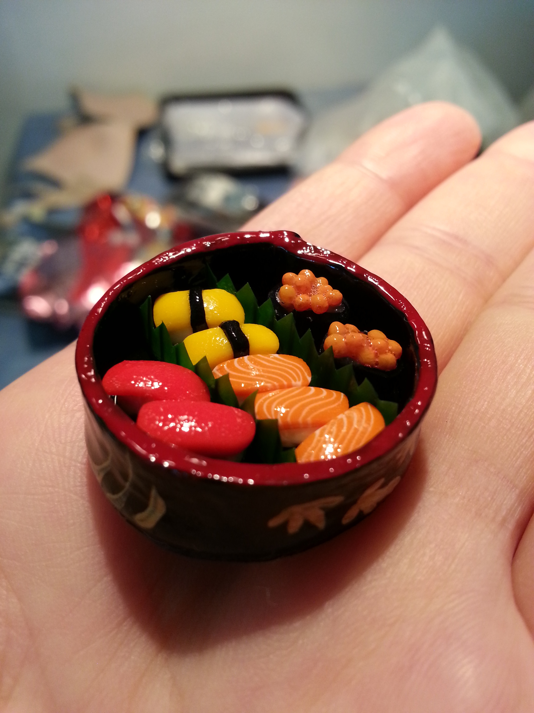

# About
### A brief history of who I am

- Home
- About
- Portfolio
- Contact

# Story
I'm Midori Funaki. Midori means green.
You might think of Midori melon liqueur but I'm not a hard drinker at all.
My friends call me "midori" or "green".
My background is a sales in animal feed and hotel industries.
I started to have interest in IT when I was living in Singapore for work.
Singapore has a policy called Smart Nation which support better living using technolgy.
This policy made me aware of tech-enabled solutions.
Thanks to this experience, I started to self-study codings on code.org.

### Background
Sales in animal feed industry / 
Hotel staff at ski resort hotel / 
Sales in hotel industry / 
Purchase assistant at a food & beverage distributor

### Leisure Activities
Pet sitting, reading books, abacus, massage

### Favorite Books
- Momo (Michael Ende)
- The Singular Impact of Exascale Computing on Us (Motoaki Saito)
- The Memory Book (Harry Lorayne, Jerry Lucas)

### Languages
Japanese, English

# Photo Album
| | 
---|---|---

|| 
---|---|---|---

| | 
---|---|---